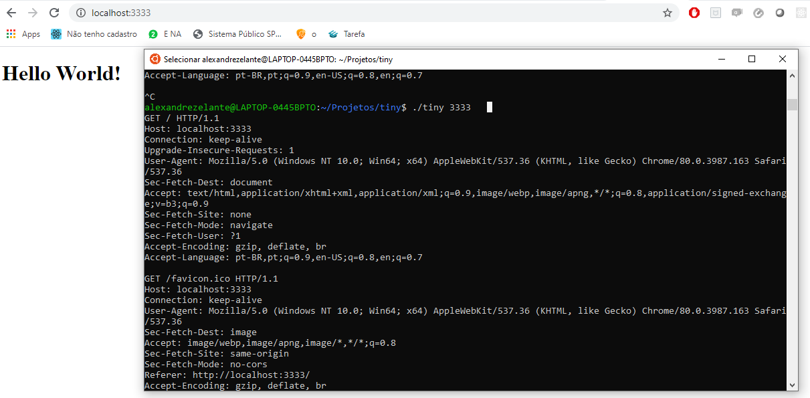

# Como utilizar tiny http

Para quem utiliza o sistema operacional Windows, terá problemas na hora de compilar o tiny, pois algumas bibliotecas não estão disponíveis no MinGW, tais como <netdb.h>.

Para os usuários de Linux e MacOS, pular as etapas do windows. (Obs: Se você utiliza MacOS, deve ter o Xcode instalado)

## Preparando o ambiente para Windows

Primeiramente você deve instalar no Windows o subsistema linux. Para isso seguir este tutorial (Que foi enviado pelo Igor Antun, valeu Igor).

https://medium.com/joaorobertopb/wsl-linux-nativo-no-windows-sem-vm-1cd6e352c995

Após instalado e computador reiniciado, abra o terminal do Ubuntu e o primeiro passo é atualizar o apt. Digite:

```
sudo apt update
```

Após atualizado, devemos instalar o compilador GCC.

```
sudo apt install gcc
```
Pronto, agora com nosso ambiente configurado, podemos realmente fazer o código funcionar.

## Rodando nosso servidor

Crie um diretório, e nele adicione o arquivo **tiny.c** e coloque o código disponibilizado tanto no site, quanto neste repositório. 

Não podemos esquecer de criar um arquivo HTML para ser renderizado ao acessarmos a rota, então vamos criar um **index.html** (Exemplo neste repositório).

Devemos compilar o tiny inserindo o seguinte código:

```
gcc -o tiny tiny.c
```

Agora vamos executar o código já compilado.

```
./tiny 3333
```
Defini a rota como 3333, mas pode ser qualquer uma.

Agora só precisamos entrar no navegador e acessar:

http://localhost:3333

E pronto!


